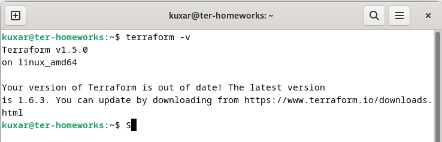
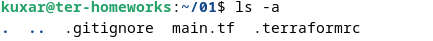
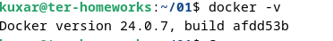
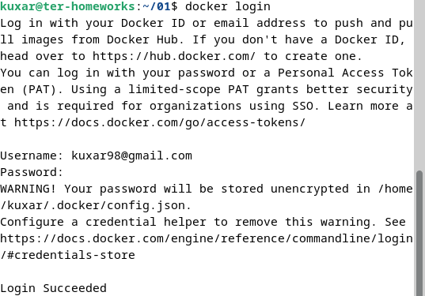
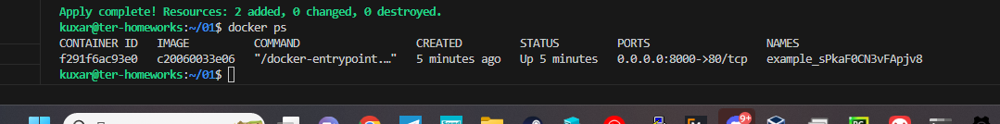
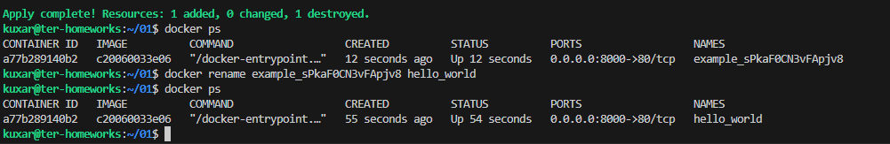
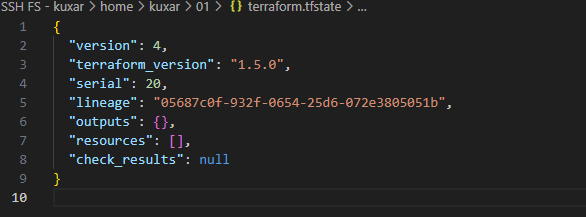
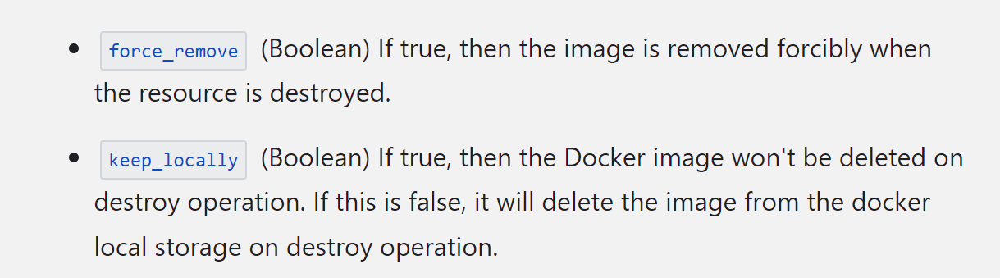
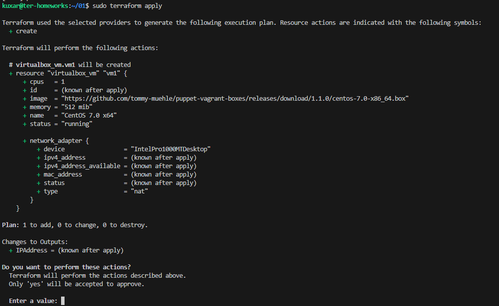
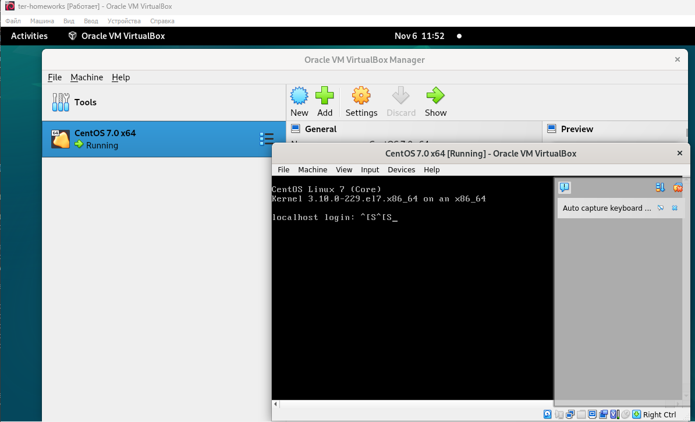

Чек-лист готовности к домашнему заданию

1. TER
   

2. 01/src
   

3. docker
   

4. docker login
   

Задание 1.

1. +
2. personal.auto.tfvars
3. "result": "sPkaF0CN3vFApjv8"
4. 
   1. Missing name for resource - отсутствовал указывающий labels "nginx".
   2. Invalid resource - name ошибка в указывающем labels "1nginx" - "nginx"
   3. Reference to undeclared resource - ошибка в сылке на объект.
   
        name  = "example_${random_password.random_string_FAKE.resulT}"

        name  = "example_${random_password.random_string.result}"
5. docker ps

6. "terraform apply -auto-approve" данная команда пименяет изменения в .tf и применяет их без просмотра плана и подтверждения пользователя.
   

7. +

8. keep_locally = true для удоления необхлдимо тзменить значение на false  
   

Задание 2. +

